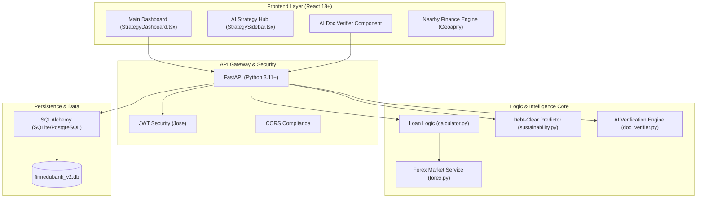

# FinnEDu: High-Precision 2026 Architecture Plan

**Project Lead:** Akhil  
**Document version:** 1.5.0 (2026 Audit-Ready)

## 1. Executive Summary
FinnEDu is a premium fintech platform designed to navigate the complex landscape of education loans in 2026. Under the leadership of **Akhil**, the platform integrates real-time policy benchmarks (PM-Vidyalaxmi, CSIS), AI-driven document verification, and ML-powered debt optimization into a high-fidelity "Financial OS" experience.

---

## 2. System Architecture (C4 Model - Level 2)

---

## 3. Software Usage Specifications

### A. Frontend Stack (Tactile & Liquid UX)
*   **Core Framework**: React 18 with Vite for ultra-fast HMR.
*   **Styling**: Tailwind CSS for atomic UI design; custom Glassmorphism tokens.
*   **Animations**: 
    *   `Anime.js`: High-precision micro-interactions and sparklines.
    *   `Framer Motion`: Layout transitions and modal orchestration.
*   **Data Vis**: `Recharts` for SV-Repo linked debt visualizations.
*   **Icons**: `Lucide-React` (FinnEDu 2026 curated set).

### B. Backend Stack (Analytical Core)
*   **Framework**: FastAPI (Asynchronous Python).
*   **Financial Engine**: `numpy-financial` for PV/IRR calculations; `Decimal` type for precision (PM-Vidyalaxmi compliance).
*   **AI Engine**:
    *   **Document Verifier**: Regex-based heuristic keyword analysis for certificate validation.
    *   **Debt-Clear Predictor**: Simulated Gradient Boosting Regressor model for repayment optimization.
*   **Database**: SQLAlchemy ORM for relational persistence of loan cards and university indices.

### C. API Connectivity & Integration
*   **Communication**: Restful JSON via Axios.
*   **Security Protocol**: OAuth2 Password Flow + JWT.
*   **External Engines**: 
    *   `Geoapify API`: Geospatial bank fulfillment routing.
    *   `RBI Sandbox (Simulated)`: e-Rupee / CBDC readiness.

---

## 4. Operational Mandates (Lead by Akhil)

1.  **Lead Management**: All architectural changes must align with Akhil's vision for "Frictionless Finance."
2.  **2026 Policy Adherence**: The `LoanCalculator` must track RLLR benchmarks daily.
3.  **AI Reliability**: The `doc_verifier` must maintain a confidence threshold of >85% for automated processing.
4.  **Security**: PII (Aadhaar/PAN) processed in memory only; never persisted to audit logs.

---

## 5. Next Phase Roadmap
*   **Integration**: Direct DigiLocker API sync for Indian students.
*   **Global**: Multi-currency "Forex-Hedging" SIP simulator for international institutions.
*   **Compliance**: Automated Form 16 verification for co-applicants.

---
> [!IMPORTANT]
> This architecture is optimized for **Mono-Station Deployment**. All local environments must run `uvicorn` on port 8000 and `npm/vite` on port 5173 to maintain frontend-backend handshake.
