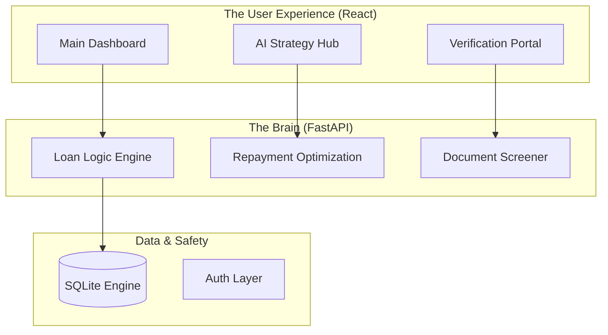

# FinEdu Flow: System Architecture
> Built and Led by **Akhil**

Hey! This is the breakdown of how FinEdu Flow actually works under the hood. I designed this to handle the massive 2026 education loan policy changes without breaking a sweat.

---

## The High-Level Flow
We're using a modern async stack. The frontend is built for speed (Vite + React), and the backend is a Python-powered beast (FastAPI) that handles all the heavy math.

---

## Tech Choices: Why I chose these
*   **React 18 + Vite**: Because index-to-render speed matters. I used **Anime.js** for the graphs because standard libraries felt too rigid for our "Liquid" UI.
*   **FastAPI**: It's way faster than Django/Flask for this kind of simulation work.
*   **SQLAlchemy**: Makes database management painless.
*   **Decimal Library**: This was a must. You can't use floats for money, especially when calculating 10-year interest subventions.

---

## My Design Principles
1.  **Calculations first**: If the math isn't 100% accurate to the 2026 RLLR standards, the app is useless. 
2.  **No Lag**: UI needs to respond instantly when you slide those EMI sliders.
3.  **Clean Code**: Services are split up so we can swap the OCR or Forex logic without tearing the whole thing down.
